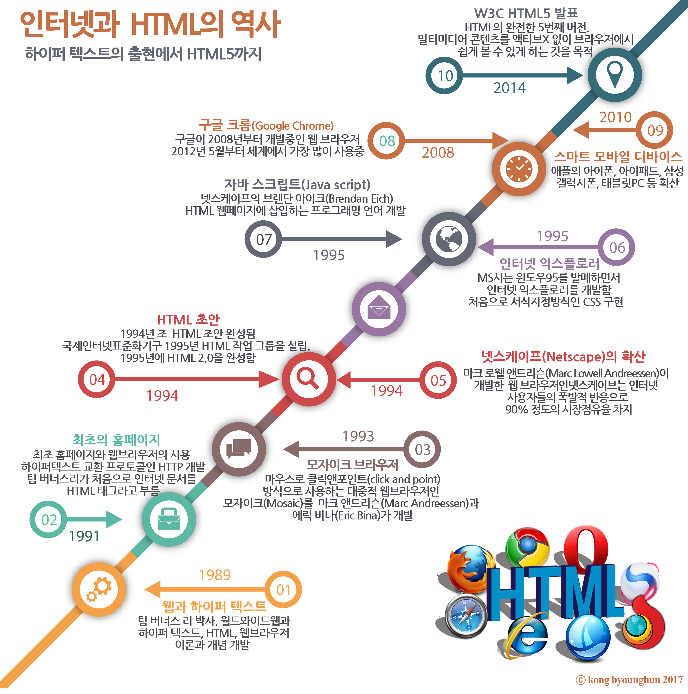
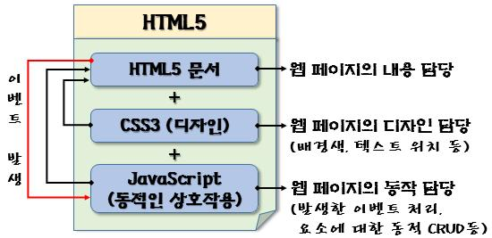

# HTML5 

## 학습 목표

### HTML5 기반의 웹페이지 제작 기술의 습득 및 향상

##### - HTML5에 새롭게 반영된 `특징`과 `기능`의 이해

	- HTML5 요소
	- CSS3
	- 자바스크립트 API

##### - 교재 구성

1. HTML5 개요 
   - HTML5 란?, 문서 작성의 기초, 웹프로그래밍 과정
2. HTML5 요소
   - 시멘틱 요소, 웹 폼 등
3. 캔버스
   - 개요, 선과 도형, 스타일, 변환, 텍스트, 이미지 등
4. SVG
   - 도형, 텍스트, 필터, 그라데이션 등
5. CSS3
   - CSS2 + 그라데이션, 변형, 전환, 애니메이션, 다단 등
6. 반응형 웹
7. HTML API
   - 오디오 / 비디오, 드래그 앤 드롭, 텍스트 편집, 웹 스토리지, 파일 접근, 웹 워커, 위치 정보

---

---


# 1강. HTML5 개요

### 학습 목표

1. HTML5의 기본 개념과 특징을 이해하고 설명할 수 있다.
2. HTML 문서의 기본 구조 및 작성 방법을 이해하고 설명할 수 있다.
3. 기본적인 HTML 문서를 작성하고 실행할 수 있다.

### 1.1 HTML5 란?

 - HTML 이란?

    - Hyper Text Markup Language
    - 웹 World Wide Web에서 사용하는 마크업 언어
       - `마크업("태크")` → 문서의 구조와 내용에 `추가적인 정보를 부여`하기 위해 삽입되는 인련의 문자 또는 기호
       - `마크업 언어` → 마크업의 `형식`과 `규칙`을 정의한 언어
    - 인터넷에서 사용하는 `웹페이지의 정보를 표현`하기 위한 언어
    - 문서안의 정보가 어떻게 구조화되는가를 지정하는 언어

 - HTML5 란?

    - HTML 4.01은 단순한 텍스트와 하이퍼링크로 웹 문서를 작성함
    - HTML 4.01에 아래 내용 추가
       - 마크업의 추가 및 삭제
       - CSS3
       - 자바스크립트 API 추가
       - 위의 3개의 내용을 추가해서 나온 것이 HTML5이다.
    - 웹에서 어플리케이션을 개발할 수 있는 플랫폼으로 진화된 형태이다.
       - 2014-10-28 HTML5
       - 2016-11-01 HTML5.1
       - 2017-12-14 HTML5.2
       - 계속 개발되어지고 있다.

 - 통칭되는 `"HTML5"`

    - `HTML5` - 콘텐츠 `내용`과 `형식`을 표현
       - 문서 구조의 의미를 명확히 하여 디자인과 프로그램의 독립성 확보
    - `CSS3` - 콘텐츠의 `표현 방법`을 정의
       - `서로 다른 다양한 브라우저 상에서 일관된 표현 기능` 제공, `효과적이고 편리한 표현` 방식으로 변경
    - `JavaScript` - 각종 API를 통해 `기능`을 표현
       - 풍부한 기능과 자원을 제어할 수 있는 로컬 애플리케이션

- HTML5의 역사

  - 

    > 이미지 출처 :  https://steemit.com/html/@hobbits84/html-history-of-internet-and-html

- W3C, WHATWG

  - http://www.w3.org
    - 웨에 대한 `표준과 기술`의 `연구와 개발`을 `총괄`해서 이끌어가는 `비영리 단체`
  - https://whatwg.org
    - `WWW를 통해 애플리케이션을 작성`하고 `전재`할 수 있는 `새로운 기술 개발`을 위해 만든 `공개 커뮤니티`

- W3C 권고안 추진 단계

  - 노트(Note) - 기술 문서로 제안하기 위해 제시된 문서 표준화하기 위한 구조나 사항을 기록하여 정리한 문서
  - 초안(WD, Working Draft) - 아직 완전하지 않은 WG의 아이디어를 담은 문서
    FPWD(First Publication Working Draft)
    LC(Last Call Working Draft)
  - 후보 권고안(CR, Candidate Recommendation) - 심사를 거친 작업 최종안
  - 제안 권고안(PR, Proposed Recommendation) - 최종적인 권고안이 될 수 있는 전 단계
  - 권고안(Recommendation) - W3C에 참여하는 회원에게 동의를 얻은 `표준안`, `최종적으로 표준화 규격`을 정의한 문서

- HTML5 디자인 원칙

  - `기존 HTML 콘텐츠`나 `브라우저 등`과의 `호환성 유지`
    - `기술 혁신을 통한 새로운 언어의 구현이 아닌 진화를 통해 발전`
  - 웹 개발자가 `최우선 순위`를 갖도록 실용성 고려
    - 웹 폼에서의 `자동 유효성 검사`,` 날짜/시간`의 자동 표시 등
  - 웹 브라우저 간의 상호 호환성 제공
    - `복잡성 제거`, `명세서의 상세한 기술`, `용이한 오류 처리`
  - 보편적인 접근성 제공
    - `모든 기기 / 플랫폼 / 언어 지원`, `누구든지 정상적인 사용`을 지원

- HTML5의 특징 (HTML의 특징)

  - 웹 문서의 표준
    - 수정 및 관리가 용이, 웹 접근성 향상, 호환성 확보
  - 마크업 언어
    - 파일 `용량이 작아` 클라이언트-서버 간 `빠른 문서 전달`이 가능
  - 일반적인 텍스트 파일
    - 별도의 전용 프로그램이 아닌 `간단한 편집기로도 작성` 가능
  - 컴퓨터 시스템과 운영체제에 `독립적`
    - 텍스트 문서 → `어떤 시스템 / 브라우저`에서도 사용 가능

- HTML5 에서 향상된 특징

  - HTML 요소의 강화

    - `시멘틱 요소 추가` → 표현 중심이 아닌 `의미 있는` 구조의 문서 작성 가능
      - header, hgroup, nav, article, section, aside, footer 등
    - `웹 폼 기능 강화` → `input 요소의 type 속성값` 및 `폼 요소 추가`
      - date, number, email, color 등 + datalist, output, progress, meter 등
    - `audio/video 요소 추가`
      - Active X등의 외부 `플러그인의 설치 없이 멀티미디어를 쉽게 구현`

  - CSS3로의 업그레이드

    - CSS1, CSS2 : 글꼴, 텍스트, 배경, 목록, 박스 모델 등 다양한 속성 제공
    - CSS3
      - 기존 설정 기능에 `상세한 속성` 추가
      - `다단`, `변형`, `변환`, `애니메이션` 등 새로운 속성 지원

  - 다양한 자바스크립트 API 지원

    - 단순한 웹 문서 작성 → 웹 애플리케이션 개발을 위한 플랫폼

      | 기능           | 설명                                                         |
      | -------------- | ------------------------------------------------------------ |
      | 캔버스         | `뒙에서 2차원 그래픽`을 그리기 위한 API 제공                 |
      | SVG            | `XML 기반의 2차원 벡터 그래픽`을 위한 API 제공               |
      | 멀티미디어     | `오디오`와 `비디오` `재생 `및 `제어`를 위한 API 제공         |
      | 드래그 앤 드롭 | 웹 브라우저 내에서 다양한 `요소의 드래깅을 제어`하는 API 제공 |
      | 위치 정보      | 디바이스의 지리적 `위치 정보`를 다룰 수 있는 API 제공        |
      | 로컬 저장소    | 웹 클라이언트에 `키와 값의 쌍으로 구성된 데이터를 저장`하기 위한 API 제공 |
      | 파일 접근      | 클라이언트 측의 `로컬 파일에 접근`해서 읽을 수 있는 API 제공 |
      | 웹 워커        | 웹 애플리케이션을 위한 `멀티 스레드 기능`에 대한 API 제공    |
      | 오프라인 웹    | `인터넷이 연결되지 않은 상태`에서도 웹 `응용 프로그램의 정상적인 기능을 지원`하기 위한 애플리케이션 캐시 API 제공 |
      | 웹 소켓        | `웹 애플리케이션과 서버 간의 직접적인 양방향 통신`을 위한 API 제공 |

### 1.2 HTML 문서 작성의 기초

- HTML 문서의 구성 요소

  - HTML 문서는 다양한 `요소element`들의 조합으로 구성
    

    > 출처 : http://www.devkuma.com/books/pages/340

- HTML 문서 작성 시 주의 사항

  - 태그 / 속성은 대소문자를 구분하지 않음
    - \<HTML\> = \<Html\> = \<html\> 모두 같지만 HTML5에서는 소문자로 작성하는 걸 권고하고 있다.
  - 파일의 확장자는 반드시 htm 또는 html로 지정
    - 파일명.htm, 파일명.html
  - 화이트스페이스는 입력한 의도대로 적용되지 않음
    - 두 칸 이상 연속된 공백은 하나의 공백으로 처리
    - 중복된 띄어쓰기를 사용하려면 `\&nbsp;` 로 처리해야한다.
  - 요소 안에 다른 요소를 포함할 수 있음
    - \<요소명1\>~\<요소명2\>~\</요소명2\>~\</요소명1\>

- HTML 문서의 기본 구조

  ```html
  <!DOCTYPE html>
  <html>
      <head>
          <!-- 문서 제목, 메타데이터, 자바스크립트, CSS -->
      </head>
      <body>
          <!-- 문서의 본문 내용 -->
      </body>
  </html>
  ```

  - 문서 유형 DOCTYPE 선언
    - 브라우저가 페이지를 올바르게 표시할 수 있도록 문서 형식을 알려주는 지시어
  - \<html\>\</html\>
    - 웹 브라우저에게 HTML 문서의 `시작과 끝`을 알려주기 위한 것
  - \<head\>\</head\>
    - title, link, style, script, meta, base 요소 → `웹 문서 자체와 관련된 정보를 제공`
      - 웹 브라우저를 통해 화면에 표시되지 않음
  - \<body\>\</body\>
    - 브라우저 화면에 실제로 출력해서 보여주려는 `모든 내용`을 포함

- 헤드 부분에 들어가는 요소

  - title 요소

    - `웹 브라우저 상단(탭)`에 HTML `문서의 제목`을 표시할 때 사용
      - `즐겨찾기 제목`으로도 사용

  - link 요소

    - `별도의 파일로 작성된 CSS 스타일`을 웹  문서에 적용 할 때 사용
      - \<link rel="stylesheet" href="파일명.css"\>

  - style 요소

    - 웹 문서 전체에서 사용될 CSS 스타일을 작성

      ```html
      <style>
      	/* CSS 스타일 정의 */
      </style>
      ```

  - script 요소

    - 자바스크립트 코드를 작성할 때 사용 → body 부분에 포함가능

      ```html
      <script>
      	/* 자바스크립트 코드 */
      </script>
      ```

  - meta 요소

    - 웹 문서의 문자 인코딩 방식, 문서에 대한 간략한 설명, 문서의 키워드, 저작자 등 다양한 정보를 표현
    - 문자 인코딩 방식 → \<meta charset="UTF-8">
    - 내용 설명 → \<meta name="description" content="문서 설명">
    - 키워드 → \<meta name="keyword" content="키워드1, 키워드2, ...">
    - 저작자 → \<meta name="author" content="웹 문서 작성자">

  - base 요소

    - 웹 문서의 기본적인 URL 경로 지정

      - body 요소 내의 상대 경로로 표시된 URL을 절대 경로로 취급

        ```html
        <base href="http://cs.knou.ac.kr/html">
        
        <a href="ex.html">
        <!-- <a href="http://cs.knou.ac.kr/html/ex.html"> -->
        ```

      - 웹페이지가 출력될 윈도우 지정

        ```html
        <base target="_blank">
        
        <a href="ex.html">
        <!-- 연결된 문서가 새로운 창에서 열림 -->
        ```

- 주석문

  - HTML 문서 소스 내에 간단한 설명을 추가할 때 사용
    - 브라우저에 의해 출력되지 ㅇ낳으므로 소스에서만 확인 가능
    - \<!-- 주석내용 --\>
    - `<!--` 와 `-->`는 하나의 문자처럼 사용 → 각 문자 사이에는 공백 불가
    - 주석 내용으로는 <, >, -- 를 사용하지 말아야 한다
  - CSS, 자바스크립트의 경우 → `/*` 주석 내용 `*/`

- 웹 페이지 구성

  - HTML 문서의 협업 관계

    - `HTML5` - 웹페이지의 `구조`와  `내용` 정의
      - (제목, 장, 절, 텍스트, 이미지, 표 등)
    - `CSS3` - 웹페에지의 `출력 모양과 디자인` 정의
      - (글자체, 크기, 색상, 여백, 배경색 등)
    - `JavaScript` - 웹페이지의 `동작`과 `상호작용`을 담당
      - (이벤트 및 요소에 대한 동적 처리 등)

  - 

    > 출처 : [https://docsplayer.org/64086896-Html5-01%EA%B0%95-html5-%EC%95%8C%EC%95%84%EB%B3%B4%EA%B8%B0.html](https://docsplayer.org/64086896-Html5-01강-html5-알아보기.html)

### 1.3 웹 프로그래밍 과정

- HTML 문서의 작성과 실행
  - 문서 작성을 위한 텍스트 편집기 → 문서 실행을 위한 웹 브라우저
    - 문서작성을 위한 텍스트 편집기
      - UltraEdit, EditPlus, Eclipse,  드림위버, 나모 웹 에디터, 워드프로세스 등등.. 
    - 문서 실행을 위한 웹 브라우저
      - IE, 크롬, 파이어폭스, 오페라, 사파리, 크로미움 엣지 등등
- HTML5 관련 기술 지원 현황
  - 아직까지 HTML5의 기능을 완벽하게 지원하는 브라우저는 없다.
  - IE를 제외하고는 대부분의 브라우저는 많은 지원을 하고있다.

