# 2강. HTML5 요소 (1)

## 학습 목표

1. 문서의 `레이아웃`을 지정하기 위한 `요소`를 활용할 수 있다.
2. HTML5에서 추가된 `인라인 수준의 시멘틱 요소`를 활용할 수 있다.
3. HTML5의 `블록 수준의 시멘틱 요소`를 활용할 수 있다.

## 01. 레이아웃을 위한 시멘틱 요소

- 시멘틱 요소?

  - HTML5의 주요 특징 중의 하나	
    - 웹 애플리케이션 개발을 위한 플랫폼, `시멘틱 요소`, 웹표준화…
  - semantic → "의미 있는", "의미의"
    - 표현 중심이 아닌 `의미 있는` 구조의 문서 작성을 위한 요소
      - HTML문서에 의미를 부여하려는 취지
    - 사람이 읽고 이해하는 것이 용이
    - 검색 엔진, 문서 해석기 등의 프로그램에 의한 문서 처리와 해석도 가능

- 포털 웹사이트 화면 구성

  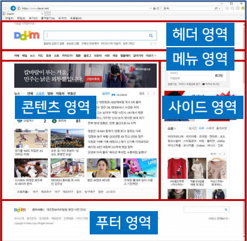

- 기본 HTML 방식의 레이아웃

  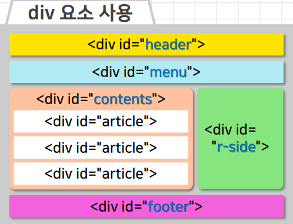

  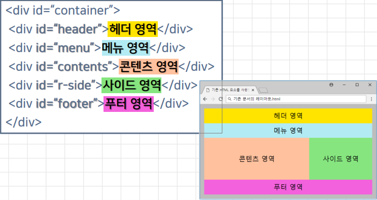

- 레이아웃을 위한 HTML 요소

  - `header` → 머리말 `(로고, 사이트 이름 등)`을 나타내는 요소
  - `hgroup` → `제목`과 `부제목`을 묶어서 나타내는 요소
  - `nav` → `메뉴 영역`을 나타내는 요소
  - `section` → 제목별로 나눌 수 있는 `문서의 콘텐츠 영역`을 구성하는 요소
  - `article` → 개별 콘텐츠를 나타내는 요소
  - `aside` → 좌우측의 `사이드 영역`을 나타내는 요소
  - `footer` → 꼬리말 `(제작자 정보 및 저작권 정보 등)`을 나타내는 요소

  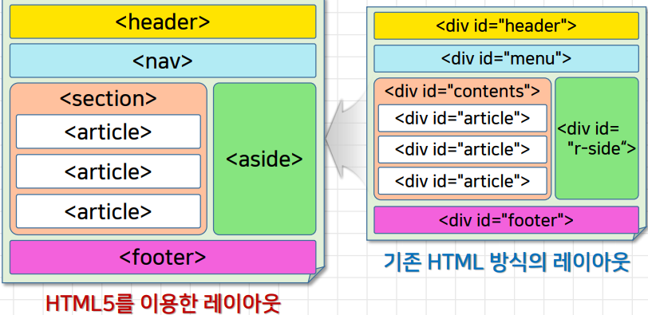

- header 요소, footer 요소

  - header 요소

    - 사이트의 이름, 로고 등을 담기 위해 사용

      ```html
      <header>머리말</header>
      <section>
      	<h1>
              제목
          </h1>
          <p>
              본문의 내용
          </p>
      </section>
      ...
      <footer>꼬리말</footer>
      
      <!-- 
      	- 위치 무관,
      	- 내용 중간에서 사용되는 경우 → 머리글 / 바닥글 역할
      	- section, header , footer 요소 포함 불가
      -->
      ```

  - footer 요소

    - 제작자 정보나 저작권 정보 등을 담기 위해 사용

- nav 요소, aside 요소

  - nav 요소

    - navigation 영역 → 주로 웹페이지 전체에 적용되는 상단의 메뉴를 표시하기 위한 하이퍼링크들을 모아 놓은 곳

  - aside 요소

    - 주요 콘텐츠 이외에 남아있는 콘텐츠나 참고가 되는 콘텐츠 등을 나타낼 때 사용

      - 본문과는 직접적인 관련이 없지만 링크나 고나련 정보를 표현

        →  주로 웹페이지 왼쪽 / 오른쪽에 위치

  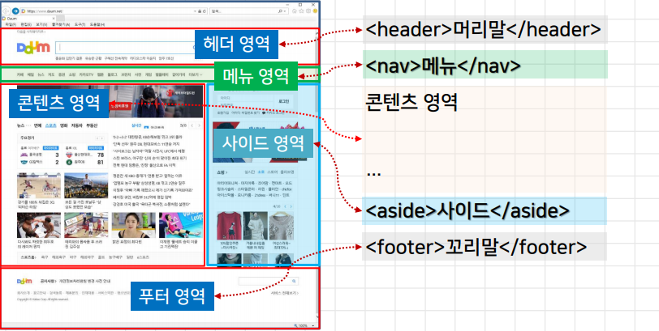

  - nav 요소

    ```html
    <body>
        <nav>
    	    <ol>
                <li><a href="..."></a></li>
                <li><a href="..."></a></li>
                <li><a href="..."></a></li>
                <li><a href="..."></a></li>
                <li><a href="..."></a></li>
                <li><a href="..."></a></li>
                <li><a href="..."></a></li>
                <li><a href="..."></a></li>
                <li><a href="..."></a></li>
                <li><a href="..."></a></li>
            </ol>
        </nav>
    </body>
    ```

- section 요소, article 요소

  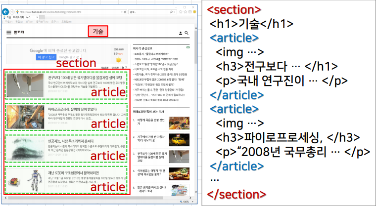

  - section 요소 
    - `하나의 주제`로 구성된 문서의 내용 영역(문서의 장 또는 절)을 구성할 때 사용
    - 하나의 section 요소에는 제목을 표현하는 오직 하나의 헤딩 요소(h1~h6)만 사용
  - article 요소
    - 독립적으로 분배 및 재사용이가능한 개별 콘텐츠(뉴스 기사, 블로그 포스트 등)를 나타낼 때 사용
      - article요소 안에 section 요소 또는 article 요소 포함 가능

- section 요소

  - 하나의 주제 않에 다른 세부 주제가 존재하는 경우

    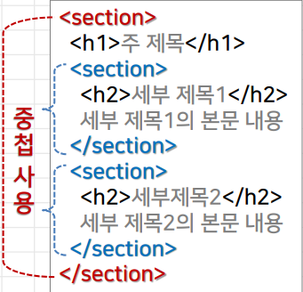

  - 하나의 요소에 2개 이상의 헤딩 요소가 사용된느 경우

    - 헤딩요소의 레벨에 따라 묵시적으로 결정

      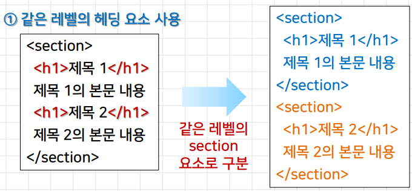

  - 하나의 요소에 2개 이상의 헤딩 요소가 사용되는 경우

    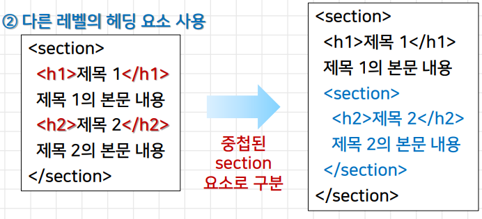

- hgroup 요소

  - 제목과 부제목을 함께 나타내기 위해 묶어주는 역할

    - 하나의 section 요소 안에서 다른 레벨의 헤딩 요소 사용 가능

      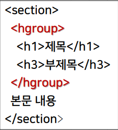

  

## 02. 시멘틱 인라인 요소

- 인라인 요소와 블록 요소

  | 인라인 요소                                               | 블록 요소                             |
  | --------------------------------------------------------- | ------------------------------------- |
  | 텍스트 요소 → 기존 내용에 이어서 작성됨                   | 문서 구조 요소 → 새로운 행에 작성됨   |
  | 입려 내용만큼의 공간을 차지해서 내용을 표시               | 하나의 줄을 전부 차지해서 내용을 표시 |
  | 줄바꿈이 수행되지 않아 앞뒤 내용이 이어져서 한줄에 표시됨 | 자동으로 줄바꿈 수행                  |
  | \<span\>, \, \<strong\>, ...                        | \<div\>, \<p\>, \<h1\>, ...           |

- mark 요소

  - 시각정 및 의미적으로 특정 문구 또는 단어를 강조

    - 강조 부분을 `노란색 형광펜`으로 표시 → CSS로 변경 가능
    - mark → "표시하다"
    - strong 요소 → 굵은 형태로 표시 → 시각적으로만 중요성 강조

    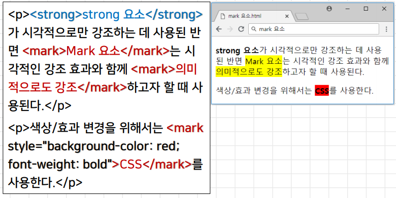

- time 요소

  - 시간이나 날짜 표현에 의미를 부여할 때 사용

    - datetime 속성 → 시간/날짜를 지정할 때 사용

      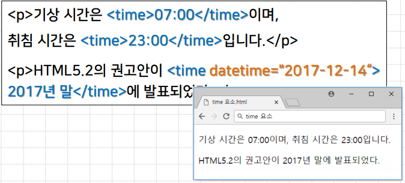

- meter 요소

  - 일정 범위 안의 측정값이나 분포 비율 등을 표시
    - "측정이 gauge" → 현재 디스크 사용량 등과 같이 일정 시점에서의 주어진 (정적인) 양을 표시

  - 속성
    - value → 실제 측정한 데이터의 값(필수)
    - min, max → 요소가 인식하는 최솟값(0,0)과 최댓값(1.0) min <= value <= max
    - low, high →  허용되는 범위의 최솟값과 최댓값, min <= low <= high
    - optimum → 최적의 기대치

  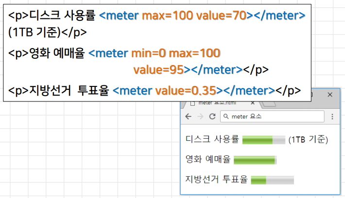

- progress 요소

  - 작업의 현재 진행 상태를 나타낼 때 사용

    - 파일 복사나 다운로드 등의 진행 정도를 표시할 때 유용
    - 속성 
      - value → 현재 진행중인 작업의 상태를 나타내는 값(0.0 ~ 1.0)
      - min, max → 작업이 전체적으로 얼마나 필요한지를 나타내는 최솟값(0,0)과 최댓값(1.0)
      - position → value 값의 현재 위치를 비율로 표시

    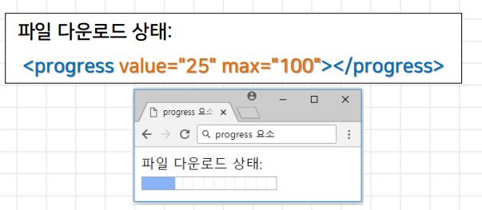

    - 반드시 자바스크립트와의 연동이 필요

      - 현재 진행 중인 상태의 값을 지속적으로 업데이트 시켜야 함

      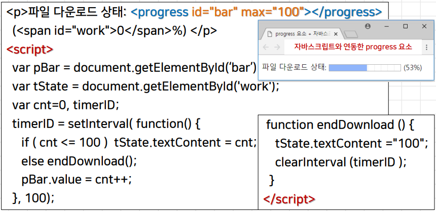

- ruby 요소

  - 하나 이상의 구문 콘텐츠에 루비 주석을 표시

    - 루비주석 → 일본어/한자의 기본 문자열 주변에 `발음법이나 의미`를 나타내기 위해 추가하는 짧은 텍스트

  - 하위 요소로서 `rt요소` 또는 `rp요소`를 함께 사용

    - ruby 요소 → 하나 이상의 문자로 구성되는 기본 텍스트 작성
    - rt요소 → 루비 주석을 구성하는 루비 텍스트 표시
               → rt요소 바로 앞에 오는 하나 이상의 구문에 주석을 표시
    - rp요소 → 루비텍스트 주위에 괄호를 둠으로써 루비 주석을 지원하지 않는 웹브라우저를 위해 사용

    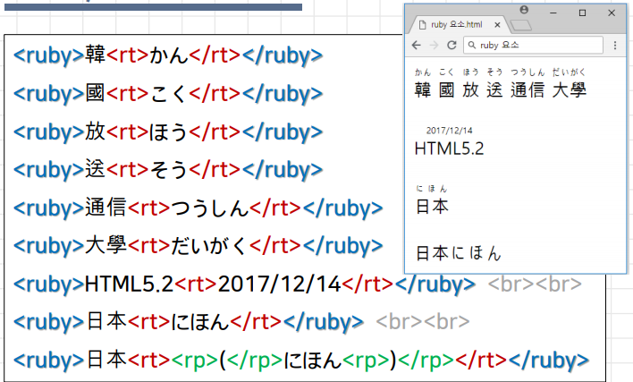

- wbr 요소

  - 텍스트에서 줄바꿈을 허용할 위치를 지정

    - "허용 위치" → `줄바꿈이 수행되어도 괜찮은 지점`을 의미
      - 해당 위치에서 실제로 줄바꿈이 수행되는 것이 아니라 레이아웃의 배치 상황에 따라 결정
    - 긴 URL 또는 단어 / 텍스트를 표시할 때 유용

    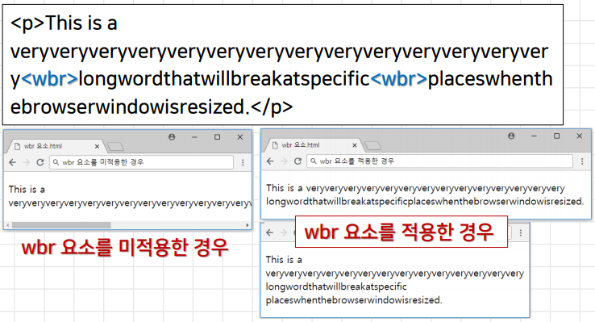

    

## 03. 시멘틱 블록 요소

- main 요소

  - 문서 body 영역의 주요 콘텐츠 블록을 지정할 때 사용

    - 문서 전체에서 반복적으로(공통적으로 들어가는 부분) 사용되는 콘텐츠는 포함 불가
      - 사이드바, 네비게이션 링크, 저작권 정보, 사이트 로고, 검색 폼 등
    - 문서에서 유일한 부분이므로 body 요소 내에서 오직 한 번만 사용
    - 문서의 전체적인 아웃라인에는 아무런 영향을 주지 않음
    - article, aside, footer, header, nav 요소의 하위 요소로 사용 불가

    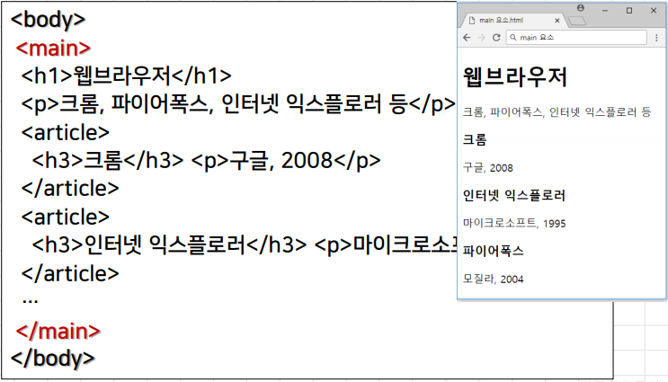

- figure 요소

  - 본문에 삽입된 그림, 다이어그램, 사진, 소스 코드, 동영상과 같은 독립적인 콘텐츠를 블록화할 때 사용

    - 요소의 위치는 주요 콘텐츠와 독립적
      - 문서의 흐름에는 아무런 영향을 주지 않음
    - figcaption 요소
      - figure 요소에 대한 캡션을 표시하는 하위 요소
      - figure 요소 바로 다음이나 맨 마지막에 위치

    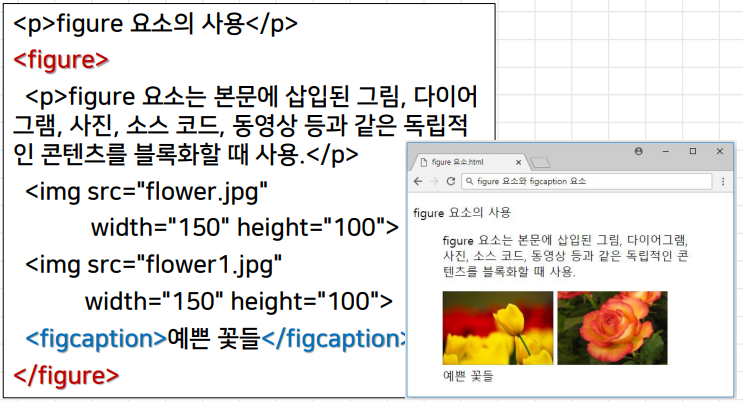

- details 요소

  - 사용자가 핸들(▶)을 클릭하여 추가적인 세부정보를 보여 주거나 숨기는 형태의 상호 작용을 지원

    - 세부정보는 어떤 종류의 콘텐츠도 가능
    - open 속성 → 세부정보가 사용자에게 보여지도록 지정
    - summary 요소
      - 세부정보에 대한 캡션을 지정하는 details 요소의하위 요소
      - 생략되면 "세부정보"라는 제목을 기본적으로 표시

    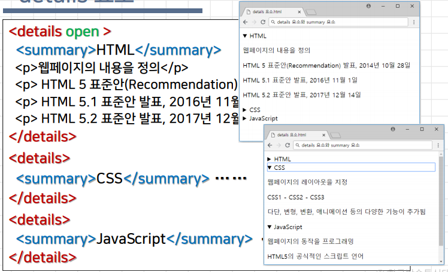

    

