# 3강. HTML5 요소(2)


## Objective

1. `웹 폼`과 `폼 요소`를 활용하여 사용자로부터 다양한 입력을 받을 수 있다.
2. HTML5로 발전하면서 `요소의 속성의 변화`를 이해하고 활용할 수 있다.


## 1. 웹 폼(web form)

- 다양한 정보의 입력

  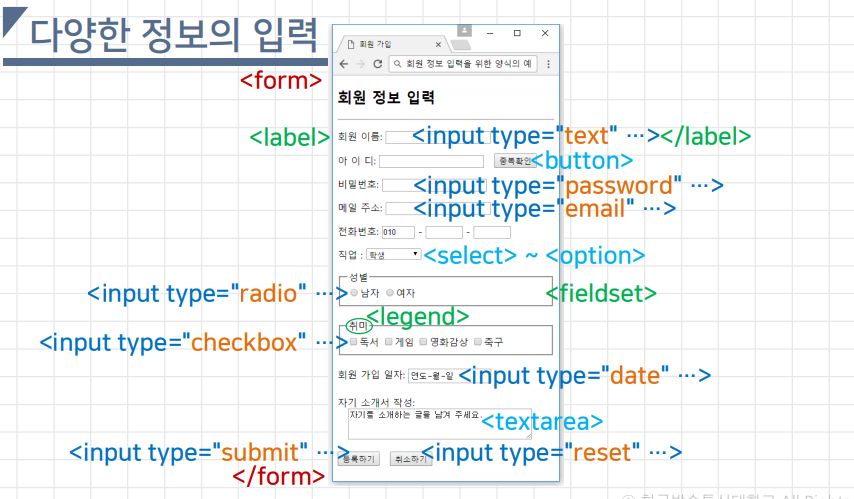

- 회원 가입을 위한 다양한 정보의 입력

  ```html
  <h2>회원 정보 입력</h2><hr>
  <form action="enroll.html" method="post">
      <p>
          <label>회원 이름: <input type="text" name="name"></label>
      </p>
      <p>
          <label>아 이 디: <input type="text" name="id">&nbsp;&nbsp;
      	<button>중복확인</button></label>
      </p>
      <p>
          <label>비밀번호: <input type="password" name="pwd"></label>
      </p>
      <p>
          <label>메일 주소: <input type="email" name="email"></label>
      </p>
      <p>
          <label>전화번호:
          <input type="text" name="tel1" size="3"
          maxlength="3" value="010">
          - <input type="text" name="tel2" size="4" maxlength="4">
          - <input type="text" name="tel3" size="4" maxlength="4">
          </label>
      </p> 
      <p>
          <label>직업 : 
              <select size="1" name="job">
                  <option selected> 학생 </option>
                  <option> 회사원 </option>
                  <option> 프로그래머 </option>
                  <option> 무직 </option>
              </select>
          </label>
      </p>
      <fieldset>
          <legend>성별</legend>
          <input type="radio" name="gender" value="male">남자
          <input type="radio" name="gender" value="female">여자
      </fieldset><br/>
      <fieldset>
          <legend>취미</legend>
          <input type="checkbox" name="hobby" value="reading">독서
          <input type="checkbox" name="hobby" value="game">게임
          <input type="checkbox" name="hobby" value="movie">영화감상
          <input type="checkbox" name="hobby" value="soccer">축구
      </fieldset><br/>
      회원 가입 일자: <input type="date" name="date"><br/><br/>
      자기 소개서 작성:<br/>&nbsp;&nbsp;
      <textarea rows="3" cols="40" name="intro">자기를 소개하는 글을 남겨 주세요.</textarea>
      <p>
          <input type="submit" value="등록하기">&nbsp;&nbsp;
      	<input type="reset" value="취소하기">
      </p>
  </form>
  
  ```

- form 요소

  - 웹페이지에서 사용자로부터 입력을 받아 서버로 전달하기 위한 요소들을 담는 컨테이너

    - 폼 요소 → 웹 폼 안에서 사용되는 요소 

      - (input, textarea, select, datalist, output 요소 등)

    - 화면에는 아무것도 표시되지 않음

      ```html
      <form action="URL" method="전송방식">
          <!--폼 요소...-->
      </form>
      ```

  - 속성

    - action="URL" → 폼 데이터를 전달받아 처리할 페이지의 URL
    - method="전송방식" → 폼 데이터를 제출할 때 사용하는 HTTP 방법
      - method="get" 또는 method="post"
    - name, accept-charset, autocmplete, enctype, novalidate, target

  - method

    |             | mehotd="get"                                                 | method="post"                                         |
    | ----------- | ------------------------------------------------------------ | ----------------------------------------------------- |
    | 전송 형태   | 기본값. 폼 데이터가 <br />이름과 값의 쌍 형태로 URL에 포함되어 전송 | HTTP Request 헤더 속에 포함시켜 전송                  |
    | 데이터 길이 | 최대 2048 글자<br />(4096 바이트)                            | 제약 없음                                             |
    | 보안        | 보안이 중요하지 않은 데이터(예 : 검색어)<br />전달에 사용    | 보안이 필요한 로그인 정보, 회원 정보 등의 전송에 사용 |

  - form 요소 사용

    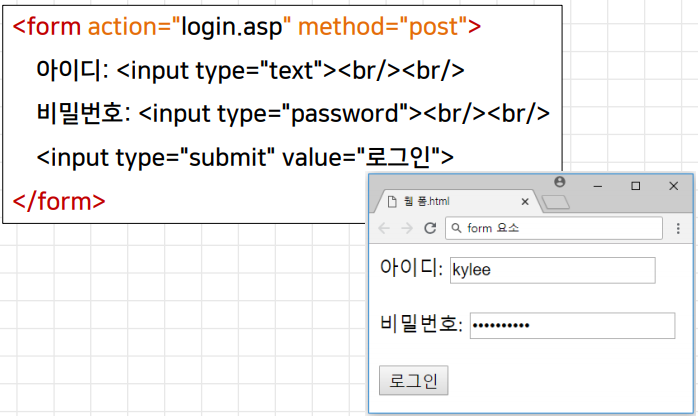

- input 요소

  - 사용자 데이터 입력을 위한 다양한 입력 타입을 지정

    ```html
    <input type="입력 타입 유형" 속성="값" ... />
    ```

    - type 속성의 값에 따라 다양한 유형의 입력 타입을 제공
    - 종료태그 없이 사용
    - 속성 → accept, alt, height, width, src, autocomplete, autofocus, checked, disabled, form, formaction, formenctype, formmethod, formnovalidate, formtarget, list, min, max, step, minlength, maxlength, multiple, name, pattern, placeholder, readonly, required, size, type, value

- input 요소의 type 속성값 (기존 HTML부터 사용한 속성값)

  | type="속성값" | 설명                                             |
  | ------------- | ------------------------------------------------ |
  | text          | 기본값. 한 줄짜리 텍스트 (기본 크기는 20글자)    |
  | password      | 비밀번호 → 입력 글자가 다른 글자로 대체되어 표시 |
  | radio         | 라디오 버튼 → 동일 그룹에서는 오직 하나만 선택   |
  | checkbox      | 체크박스 → 0개 이상의 항목 선택 가능             |
  | hidden        | 사용자에게 보이지 않는 상태로 데이터 입력        |
  | file          | 파일 업로드를 위한 파일 선택 버튼                |
  | image         | 이미지를 제출 버튼으로 지정                      |
  | submit        | 폼 데이터를 서버로 전송하는 제출 버튼            |
  | reset         | 모든 입력값을 초기화하는 버튼                    |
  | button        | 클릭 가능한 일반 버튼                            |

  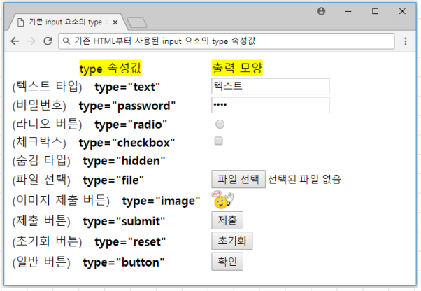

- input 요소의 type 속성값 (HTML5에서 추가된 속성값)

  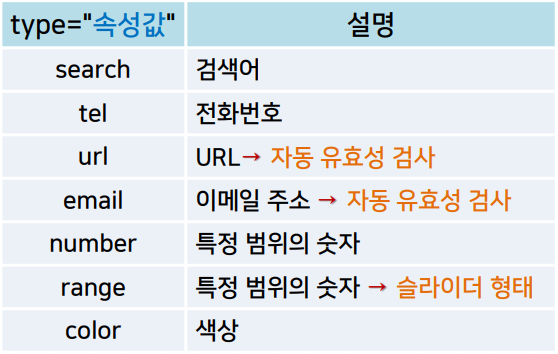

  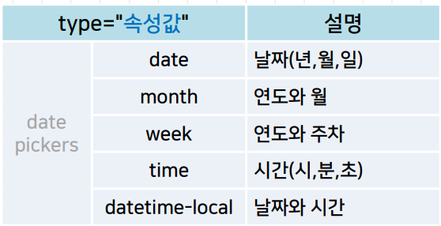

  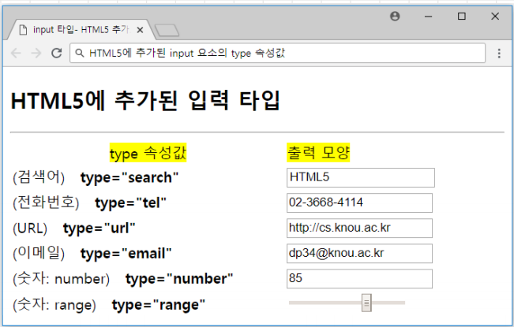

  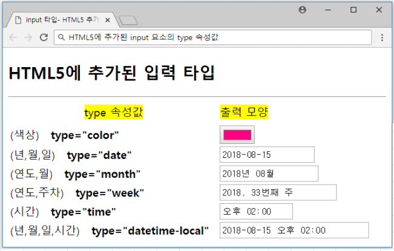

- textarea 요소

  - 여러 줄에 해당하는 텍스트의 입력 / 출력을 위해 사용

    - \<input type="text"\> → 한 줄에 해당하는 짧은 텍스트 입력

      ```html
      <textarea rows="숫자" cols="숫자">
      	<!-- 텍스트 영역에 표시할 내용(출력용) -->
      </textarea>
      ```

    - 속성

      - name, rows, cols, wrap, readonly
      - input 요소의속성도사용가능→ autofocus, disabled, form, maxlength, placeholder, required 등

  - 주요 속성

    - name=“이름” → 텍스트 영역의 이름

    - rows=“숫자” → 텍스트 영역의 높이(라인 수)

    - cols=“숫자” → 텍스트 영역의 너비(한줄에 입력할 수 있는 글자 수)

    - wrap=“속성값” → 폼으로 전송될 때 줄바꿈 포함 여부

      - soft  → 기본값. 자동으로 줄바꿈이 포함되지 않음
      - hard → 자동으로 줄바꿈이 포함되어 전송(cols속성 지정 필요)

    - readonly → 텍스트 영역을 읽기 전용(입력불가, 출력용)으로만 사용

      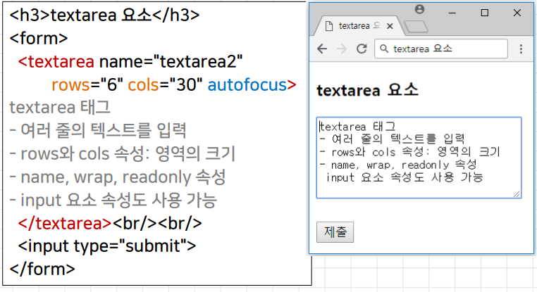

- select 요소

  - 드롭다운 리스트를 만들 때 사용

    - options 요소

      - select요소/datalist 요소의 하위 요소 → 리스트에서 각 항목을 정의

        ```html
        <select 속성="값" ...>
            <option value="값" ...>항목1</option>
            <option value="값" ...>항목2</option>
            ...
            <option value="값" ...>항목n</option>
        </select>
        ```

  - select 요소의 속성

    - name="이름" → 드롭다운 리스트의 이름
    - size="숫자" → 화면에 한 번에 보여지는 항목의 개수
    - mulitple → 여러 개의 항목을 한 번에 선택할 수 있도록 지정

  - options요소의 속성

    - disabled → 해당 항목을 비활성화 시킴
    - label="텍스트" → 옵션의 긴 항목을 짧은 텍스트로 value의 우측에 표시
    - selected → 페이지가 로드될 때 초깃값으로 선택될 항목
    - value="텍스트" → 서버로 전달되는 항목 값

    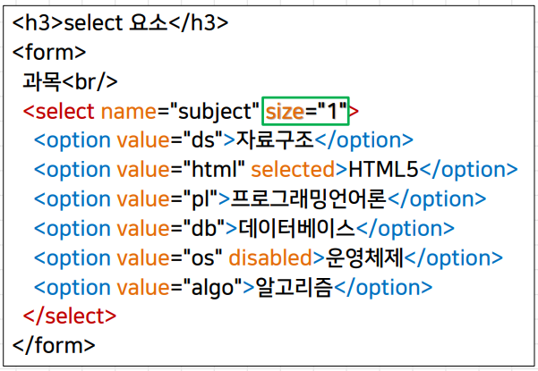

    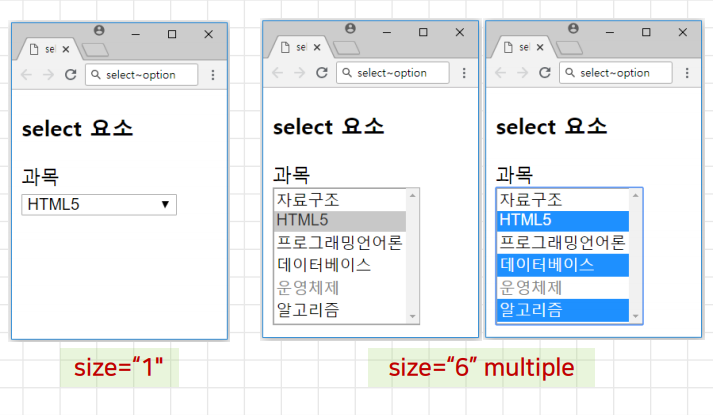

    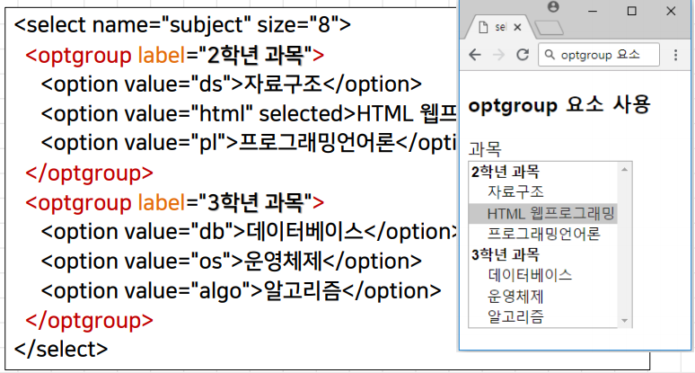

- datalist 요소

  - <input  type="text" ...>에 대한 옵션 목록을 지정
    - 텍스트 타입이 포커스를 받으면 미리 입력한 항목이 드롭다운 형태로 표시
    - input 요소의 list 속성과 datalist요소의 id속성을 사용하여 연결 → 동일한 속성값으로 지정

  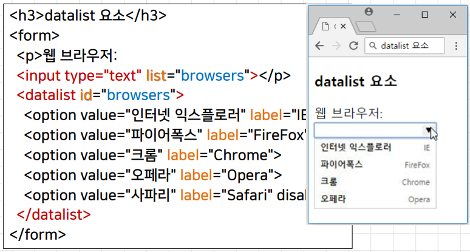

- output 요소

  - 폼 내의 다양한 값을 출력할 수 있도록 지정

    - 특정 input 요소에 입력된 값이 변하게 되면 그것을 곧바로 반영하여 화면으로 출력할 때 사용
      - input 요소의 값이 변할 때 발생하는 form 요소의 input 이벤트 활용 → 자바스크립트 문법으로 출력할 값의 연산식을 지정

    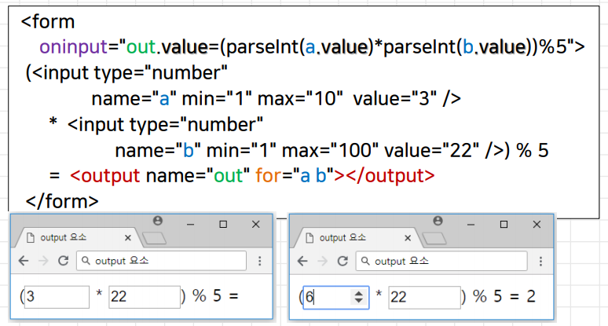

- fieldset 요소

  - 폼에서 사용된 관련 요소들을 그룹핑할 때 사용
    - 관련 요소들을 포함하는 사각형 테두리가 표시됨
      - 속성 → name, form, disabled
    - legend 요소
      - fieldset 요소의 하위 요소 → 그룹핑 되는 요소들에 대해 사각형 테두리 선 상에 캡션을 표시

- label 요소

  - input 요소에 대한 레이블 정의 
    - 시각적 효과 없음 → 단지 마우스 사용자의 사용성 향상
      - label 요소 내에 있는 텍스트를 클릭해도 해당하는 input요소의 선택이 가능

- fieldset 요소, label 요소

  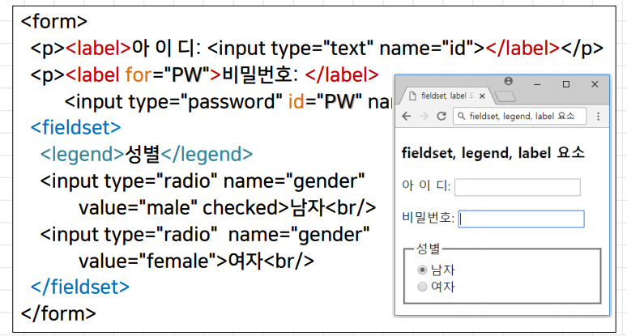


## 2. HTML5에서 요소의 변화

- HTML5에서 추가된 요소
  - header, hgroup, nav, section, article, aside, footer
  - mark, time, meter, progress, ruby(rt, rp), wbr (인라인)
  - main, figure(figcaption), details(summary)
  - datalist, output
  - canvas, picture(source), audio(source), video(source)
- HTML5에서 추가된 속성
  - form 요소 → autocomplete, novalidate
  - input 요소 → autocomplete, form, formaction, formenctype, formmethod, formnovalidate, formtarget, height, width, list, min, max, step, minlength, multiple, pattern, placeholder, required
  - \<input type="__"\> → search, tel, url, email, number, range, color, date, month, week, time, datetime-local
- 지원이 중단된 주요 요소
  - 단순히 외양 지정에 사용되어 CSS로 처리 가능한 요소
    - basefont, big, center, font, strike, tt, u, …
  - 프레임 관련 요소들
    - frame, frameset, noframes
  - 거의 사용되지 않아 다른 요소로 대체 가능한 요소들
    - applet → embed, acronym → abbr, bgsound→ audio, …
- 지원이 중단된 주요 속성
  - \<a name="..."\>
  - \<script language="..."\>
  - \
  - \<body alink=“…” link=“…” vlink=“…” bgcolor=“…” …\>
  - \<ul type="…" \>
  - \<hr color="..." ...\>
  - \<table width="..." cellpadding="..." ...>
  - \<h1 align="..."\>
  - \<p align="..."\>
- 적용 의미가 변경된 요소
  - b 요소
    - 강조 → 주목해야할 단어를 단순히 진하게 표시하는 최후의 수단
      - 적절한 다른 요소가 없을 때 만 사용
  - i 요소
    - 이탤릭체, 강조→ 보통의 서술과 구분되는 다른 어조나 분위기를 갖는 텍스트, 기술용어, 다른 언어의 구문, 사상, 선명 등을 표시
      - 적절한 시멘틱 요소가 없을 경우에 한해서 사용
  - cite 요소
    - 이탤릭체, 인용→ 작품(책, 노래, 영화, 그림, 조각등)의 제목을 나타낼 때 사용
  - hr요소
    - 수평선→ 페이지 내에서 주제가 변경되어 콘텐츠를 구분하는 의미론적 용도
  - s요소
    - 취소선, 대체/삭제되는 텍스트 표시 → 더 이상 정확하지 않거나 관련이 없는 텍스트를 표시
  - address 요소
    - 이탤릭체, 요소 앞/뒤에서 줄바꿈 수행, 이름/이메일/전화번호 등 표시→ 실제 우편물 주소
      - body 요소 내에서 사용→ 문서 저자의 정보
      - article 요소 내에서 사용→ 해당 기사의 저자의 정보
  - a 요소
    - 하이퍼링크나 앵커 → 항상 하이퍼링크 또는 하이퍼링크 표시자
      - name 속성은 id로 대체
      - download, media 속성 등이 추가
  - u 요소
    - 밑줄→ 철자가 틀린 단어나 중국어의 고유 명사와 같이 일반 텍스트와 스타일이 다른 텍스트를 표시
      - 하이퍼링크와 혼란 야기→ 사용 자제
  - strong 요소
    - 진하게, 강조→ 중요한 텍스트 표시
  - small 요소
    - 텍스트를 작게 표시→ 작게 표시해야 하는 부수적 해설이나 이용 조건 또는 법적 공지 등을 표시

