# 4강. 캔버스(1)


## Contents

1. 캔버스 개요
2. 선과 도형 그리기


## Objective

1. 캔버스 개념과 작업 과정을 이해하고 활용할 수 있다.
2. 캔버스에 선과 다양한 도형(사각형, 다각형, 원/원호, 부채꼴, 베지에 곡선)을 그릴 수 있다.


## 1. 캔버스 개요

### 캔버스


#### - 자바스크립트 코드를 이용하여 웹브라우저에 그림을 그리는 기능

- 별도의 프로그램 설치 없이 사용 가능
- 단순히 그림을 표현하는 기능 이외에 그림의 합성, 변환, 애니메이션 같은 다양한 효과의 표현도 가능


#### - 그림을 그리기 위해서는

- canvas 요소를 사용해서 그림이 그려질 영역을 지정함
- 자바스클비트 코드를 사용해서 해당 영역에 실제 그림을 그림


### 캔버스 좌표 시스템

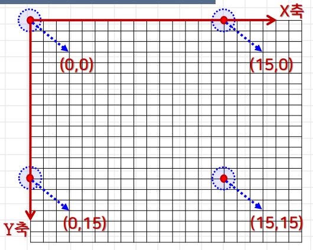


### 그림 영역 지정

#### - canvas 요소를 사용해서 캔버스 영역을 지정

- 캔버스 영역 → 웹페이지에서 그림이 그려지는 사각형 영역

  ```html
  <canvas id="아이디" width="폭" height="높이">
   이 요소를 지원하지 않는 브라우저에 출력할 내용 표시
  </canvas>
  ```

  - 기본 크기(width/height 속성 생략) → 폭 300px, 높이 150px


```html
<canvas id="myCanvas" width="500" height="300" style="border: 1px solid red">
 이 브라우저는 HTML5의 canvas 요소를 지원하지 않습니다.
</canvas>
```


#### - 캔버스 크기와 드로잉 표면의 크기

- canvas 요소의 width/height 속성을 사용하는 경우

  - 캔버스 크기 = 드로잉 표면의 크기

- CSS를 사용해서 캔버스 크기를 지정하는 경우

  ```html
  <canvas id="myCanvas">
  	캔버스 미지원 ...
  </canvas>
  <!-- 드로잉 표면 크기 300 x 150 -->
  
  <style>
      canvas {
          width: 500px;
          height: 300px;
      }
  </style>
  <!-- 캔버스 크기 500 x 300 -->
  ```


### 캔버스 컨텍스트

#### - 캔버스 객체 생성

```javascript
var 변수1 = document.getElementById("캔버스 아이디");
var canvas = document.getElementById("myCanvas");
```

#### - 캔버스 컨텍스트 객체 생성

```javascript
var 변수2 = 변수.getContext("2d");
var context = canvas.getContext("2d");

// 메서드 체이닝으로 한줄로 표현 가능
var context = document.getElementById("myCanvas").getContext('2d');
```


### 캔버스 작업의 기본 형태

```html
<body>
    <canvas id="myCanvas" width="350" height="200" style="background-color: lightblue;">
    	이 브라우저는 HTML5의 canvas요소를 지원하지 않습니다.
    </canvas>
    <script>
    	var canvas = document.getElementById("myCanvas");
        var context = canvas.getContext('2d');
        
        // 빨간색으로 텍스트 그리기
        context.font = "20px 굴림체";
        context.fillStyle = "red";
        context.fillText = ("캔버스 맛보기", canvas.width / 2 - 70, canvas.height / 2 - 5);
        
        // 파란색으로 사각형 그리기
        context.strokeStyle = "blue";
        context.strokeRect(70, 40, 200, 100);
        
        // ----------------------------------- //
        
        // 이벤트를 활용하는 경우
        
        function 함수명() {
	    	var canvas = document.getElementById("myCanvas");
	        var context = canvas.getContext('2d');
            // 빨간색으로 텍스트 그리기
            context.font = "20px 굴림체";
            context.fillStyle = "red";
            context.fillText = ("캔버스 맛보기", canvas.width / 2 - 70, canvas.height / 2 - 5);

            // 파란색으로 사각형 그리기
            context.strokeStyle = "blue";
            context.strokeRect(70, 40, 200, 100);
        }
        
        // <body onload="함수명();"> 으로 사용가능
        
    </script>
</body>
```


## 2. 선과 도형 그리기


### 사각형 그리기

#### - 시작점(x,y), 폭 w, 높이 h

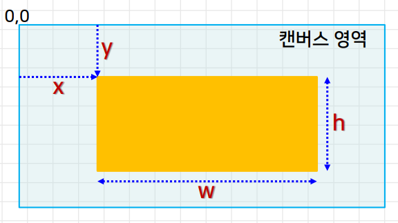


### 사각형 그리기 관련 메서드

#### - context.strokeRect(x, y, w, h) 

- 테두리만 있는 사각형을 그림
  - 관련 속성 → strokeStyle, lineWidth, lineJoin


#### - context.fillRect(x, y, w, h)

- 색이 채워진 사각형을 그림
  - 채우기 스타일 fillStyle 속성 사용


#### - context.clearRect(x, y, w, h)

- 지정한 사각형 영역을 지움
  - 영역 안의 모든 픽셀을 투명한 검은색으로 채움


```html
<body>
    <canvas id="myCanvas"></canvas>
    <script>
    	var canvas = document.getElementById("myCanvas");
        var context = canvas.getContext("2d");
        canvas.width = 300;
        canvas.height = 300;
        canvas.style.backgroundColor = "lightyellow";
        
        // 사각형 그리는 부분
        context.lineWidth = 10;
        context.strokeStyle = "blue";
        context.fillStyle = "green";
        
        context.strokeRect(50, 50, 100, 100);
        context.fillRect(150, 150, 100, 100);
        context.clearRect(100, 100, 100, 100);
        
        // 캔버스 전체 영역을 지우려면
        context.clearRect(0, 0, canvas.width, canvas.height);
    </script>
</body>
```

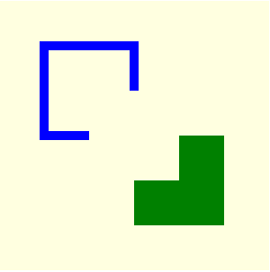


### 그리기의 2가지 유형

#### - 즉시 그리는 방법

- 관련 함수를 호출하면 어떤 단계도 거치지 않고 바로 캔버스에 그림을 그리는 방법
  - strokeRect(). fillRect(), clearRect(), strokeText(), drawImage()


#### - 패스 path를 기반으로 그리는 방법

- 패스 → 각 도형을 이루는 선들의 집합
  - 서브패스 → 각각의 선


### 패스 기반 그리기

#### - 패스 기반의 선/도형을 그리는 과정

1. 패스를 초기화한다. → beginPath() 메서드
2. 다양한 메서드를 사용하여 패스를 지정하고 선/도형을 그린다.
3. 지정한 패스를 닫는다. → closePath() 메서드
4. 선이나 도형을 출력한다. → stroke() 또는 fill() 메서드


#### - 패스 기반 method

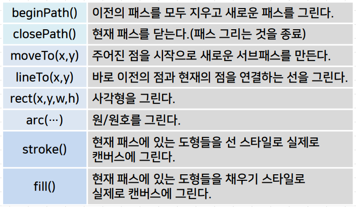


### 선 그리기

#### - 선을 그리는 방법

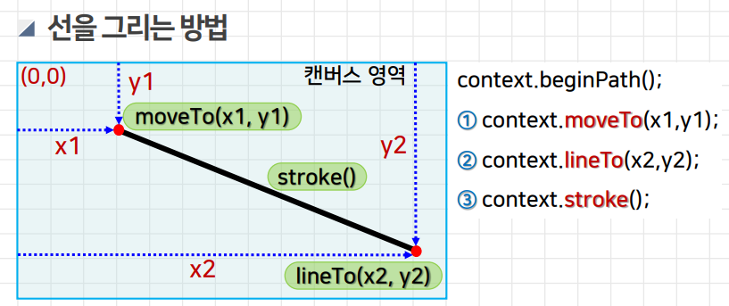


```javascript
context.beginPath();
context.moveTo(50, 50);
context.lineTo(200, 200);
context.stroke();
// ---------------------------- //

context.beginPath();
context.moveTo(50, 50);
context.lineTo(200,50);
context.lineTo(200, 200);
context.lineTo(50,200);
context.lineTo(50,50);
context.stroke();
```

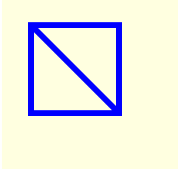


### 다각형 그리기

#### - 선들을 연결해서 연속적으로 그리는 방법

```javascript
context.beginPath();
context.moveTo(100, 25);
context.lineTo(175,177);
context.lineTo(25,175);
context.lineTo(100,25);
context.stroke();
```

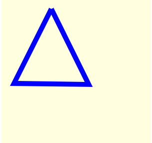


#### - 선그리기 메서드 + closePath()

- closePath() → 둘 이상의 점을 가진 경우에는 마지막 점과 첫 번째 점을 연결하는 직선을 추가하여 닫힌 모양의 도형을 만듦

  ```javascript
  context.beginPath();
  context.moveTo(100, 25);
  context.lineTo(175,177);
  context.lineTo(25,175);
  context.closePath();
  context.stroke();
  ```

  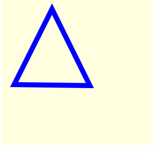


```javascript
context.beginPath();
context.moveTo(50, 50);
context.lineTo(200,50);
context.lineTo(200, 200);
context.lineTo(50,200);
context.closePath();
context.stroke();
context.fill(); 
```

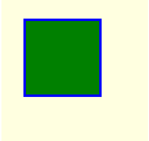


### 원 / 원호 그리기


#### - arc() 메서드

```javascript
context.arc(x, y, 반지름, 시작각도, 종료각도, 그리는_방향);
```

- x, y, 반지름 → 원의 중심의 좌표와 반지름

- 시작 각도, 종료 각도 → 라디안 단위 사용(360도 = 2π)

  ​							→ 각도 * Math.PI / 180

- 그리는 방향

  - false → 기본값. 시계 방향으로 그리는 경우
  - true → 시계 반대 방향으로 그리는 경우

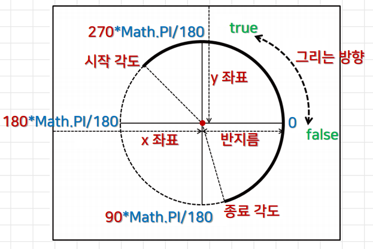


### 원 / 원호 그리기 예제 1)

```javascript
context.beginPath();
context.arc(100, 100, 75, 0, 2*Math.PI, true);
context.stroke();
// context.fill(); 이라면 원 안에 색이 채워진다.
```

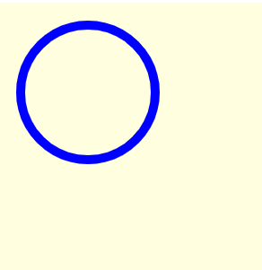


```javascript
context.beginPath();
context.arc(100, 100, 75,135*Math.PI/180, 315*Math.PI/180, true);
context.stroke();
// 시계 반대방향
```

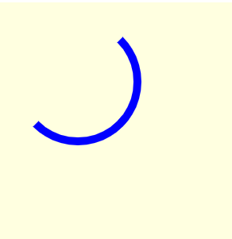

```javascript
context.beginPath();
context.arc(100, 100, 75,135*Math.PI/180, 315*Math.PI/180, false);
context.stroke();
// 시계 방향
```


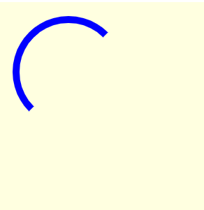


```javascript
context.beginPath();
context.arc(100, 100, 75, 225*Math.PI/180, 45*Math.PI/180, false);
context.stroke();
// 시계 방향
```

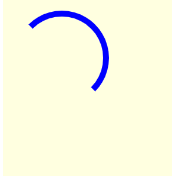


```javascript
context.beginPath();
context.arc(100, 100, 75, 225*Math.PI/180, 45*Math.PI/180, true);
context.stroke();
// 시계 반대 방향
```

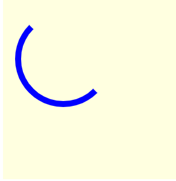


### 원 / 원호 그리기 예제2)

```javascript
context.beginPath();
context.arc(100, 100, 75, 0*Math.PI/180, 90*Math.PI/180, false);
context.fill();
context.beginPath();
context.arc(100, 100, 75, 90*Math.PI/180, 180*Math.PI/180, false);
context.fill();
context.beginPath();
context.arc(100, 100, 75, 180*Math.PI/180, 360*Math.PI/180, false);
context.fill();
```

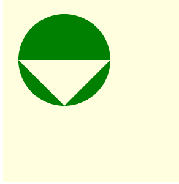


### 부채꼴 그리기

#### moveTo() → arc() → closePath()

```javascript
context.beginPath();
context.moveTo(100, 100);
context.arc(100, 100, 75, 0, 90*Math.PI/180, true);
context.closePath();
context.stroke();

context.beginPath();
context.moveTo(110, 110);
context.arc(110, 110, 75, 0, 90*Math.PI/180, false);
context.closePath();
context.fill();
```

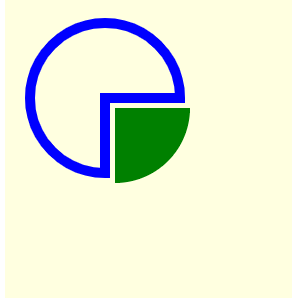


### 직선과 접하는 원호 그리기

#### moveTo(x, y) → arcTo(x1, y1, x2, y2, 반지름) 

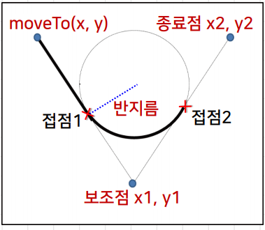

```javascript
context.beginPath();
context.moveTo(30, 30);
context.arcTo(100, 170, 180, 80, 50);
context.fill();
context.stroke();
```

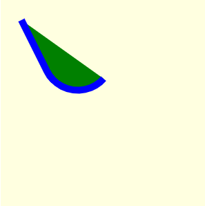


### 베지에 곡선 그리기

#### 베지에 곡선 Bezier Curve

- n개의 점으로부터 얻어지는 (n - 1)차 곡선
- 2차 베지에 곡선
  - quadraticCurveTo( 제어점x, 제어점y, 종료점x, 종료점y )
- 3차 베지에 곡선
  - bezierCurveTo 
    ( 제어점x1, 제어점y1, 제어점x2, 제어점y2, 종료점x, 종료점y )


### 2차 베지에 곡선

```javascript
2차 베지에 곡선 (A, B, C) {
    // 시작점 A, 제어점 B, 종료점 C
    D ← 선분 AB의 중점;
    E ← 선분 BC의 중점;
    F ← 선분 DE의 중점;
    F를 베지에 곡선 상의 한 점으로 저장;
    2차베지에곡선 (A, D, F);
    2차베지에곡선 (F, E, C);
}
```

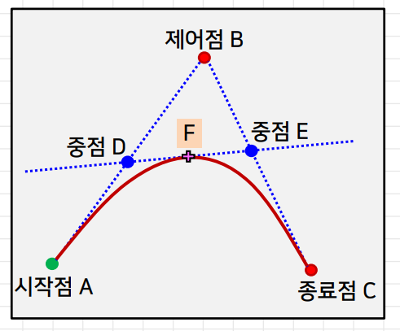

```javascript
context.beginPath();
context.moveTo(50, 150);
context.quadraticCurveTo(130, 50, 180, 180);
context.stroke();
```

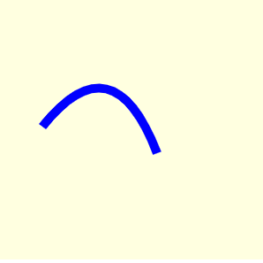


### 3차 베지에 곡선

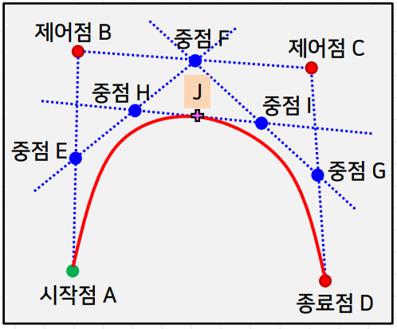

```javascript
context.beginPath();
context.moveTo(30,50);
context.bezierCurveTo(50,180,130,180,180,50);
context.stroke();
context.fill();
```

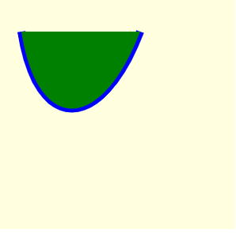

