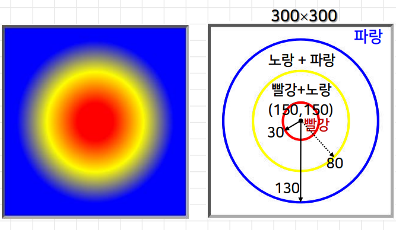

# 5강. 캔버스 (2)


## 1. 스타일 지정하기

### 선 스타일 관련 속성

- context.strokeStyle
  - 선의 색상(또는 그라데이션, 패턴)지정
- context.lineWidth
  - 선의 두께 지정(기본 1.0픽셀)
- context.lineJoin [= bevel | round | miter(기본) ]
  - 두 선이 만나 꺾이는 모서리 부분의 모양 지정
- context.lineCap [= butt(기본) | round | square ]
  - 선의 양쪽 끝부분의 모양 지정


### 선 스타일


```javascript
context.beginPath();

context.lineWidth = 30;
context.strokeStyle = 'rgba(255,0, 255, 0.5)';
context.lineCap = 'round';
context.lineJoin = 'bevel';

context.moveTo(50, 50);
context.lineTo(200, 250);
context.lineTo(250, 120);
context.stroke();
```


### 점선 그리기

- setLineDash() 메서드

  - 원하는 점선의 패턴을 설정

    

    


### 채우기 스타일

- fill() 메서드를 사용하는 경우
  - 도형의 외곽선 출력 stroke() → strokeStyle 속성
  - 도형을 채우는 fill() → ?
- 속성
  - fillStyle
    - 도형을 채우는 색상이나 스타일 지정
  - globalAlpha
    - 색상의 투명도 지정
    - 값 → 0.0(완전 투명) ~ 1.0(완전 불투명)


### fillStyle 속성


### globalAlpha 속성


### 그라데이션 스타일

- 두가지 이상의 색상이 점진적으로 변하는 효과
  - createLinearGradient(x1, y1, x2, y2)
    - 선형 그라데이션 지정
  - createRadialGradient(x1, y1, r1, x2, y2, r2)
    - 방사형 그라데이션 지정
  - addColorStop(오프셋, 색상)
    - 그라데이션 경계색


### 선형 그라데이션


### 방사형 그라데이션





### 패턴 스타일

- createPattern( 이미지변수, 반복형식 )

  - 채우기를 위한 이미지 패턴 생성

    ```javascript
    var 변수1 = new Image();
    변수1.src = ‘이미지 파일 주소’;
    var 변수2 = context.createPattern(변수1, 반복형식);
    context.fillStyle = 변수2;
    ```

    

- '반복형식'의 값

  


### 그림자 스타일

- 관련 속성
  - shadowColor
    - 그림자 색상 지정 (기본값 → 완전 투명한 검은색 rgba(0,0,0,0))
  - shadowOffsetX
    - 대상을 기준으로 그림자의 수평 오프셋 지정(기본값 → 0)
  - shadowOffsetY
    - 대상을 기준으로 그림자의 수직 오프셋 지정(기본값 → 0)
  - shadowBlur
    - 그림자의 흐림 정도 지정 (기본값 → 0)


### 그림자 스타일 예제 1


### 그림자 스타일 예제 2


### 도형 합성

- globalCompositeOperation 속성
  - 도형이 그려지는 순서에 상관 없이 도형 간의 겹쳐지는 부분에 대한 다양한 처리가 가능
- 속성
  - source-atop, source-in, source-out, source-over(기본값)
  - destination-atop, destination-in, destination-out, destination-over
  - lighter, copy, xor
    - destination → 속성 지정 이전에 먼저 그려진 도형
    - source → 속성 지정 이후에 그려진 도형


## 2. 텍스트 그리기

- 관련 메서드
  - context.strokeText(텍스트, x, y [ , maxWidth ] )
    - 지정된 위치 (x,y)를 기준으로 테두리만 있는 텍스트를 그림
    - maxWidth → 텍스트가 maxWidth의 크기에 맞게 조정해서 그려짐
  - context.fillText( 텍스트, x, y [ , maxWidth ] )
    - 지정된 위치 (x,y)를 기준으로 색이 채워진 텍스트를 그림
  - 변수 = context.measureText(텍스트)
    - 현재 글꼴에서 주어진 텍스트의 폭을 반환
    - 변수.width


### 텍스트 그리기 예제 1


### 텍스트 그리기 예제 2


### 텍스트 그리기 예제 3


### 텍스트 그리기 관련 속성

- 관련 속성
  - context.font
    - 글자 스타일, 글자 크기, 글자체 지정(기본값 → “10px sans-serif”)
    - context.font= “italic 15pt 굴림체”
  - context.textAlign
    - 수평 방향의 정렬 방식 지정→ left, right, center, start, end
  - context.textBaseline
    - 텍스트의 수직 방향의 기준선 지정
    - top, hanging, middle, alphabetic, ideographic, bottom


### textAlign 속성


### textBaseline 속성


### 텍스트 그리기 예제 4


